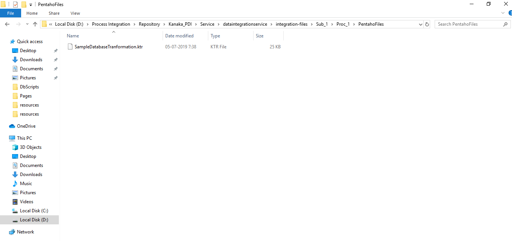

# Sigmaflw

Sigmaflw is an open source application for monitoring data transformation processes created using Pentaho Data Integration (PDI) tool for data transformation.  


## Getting Started / Installation


### Built With
 This application is generated with [Angular CLI](https://github.com/angular/angular-cli) version 7.3.5.    
 It uses SpringBoot, Spring REST, Spring Data JPA, Maven and Pentaho API to build Data Integration Service.  

### Prerequisites
- Node.js need to be installed on local machine to run npm commands required for the configuration of the application.  
   install [node.js](https://nodejs.org/en/) here.  
- Angular/cli needs to be installed to run application.
```bash
npm install -g @angular/cli
```

- Java (version 8) and [maven](http://maven.apache.org/download.cgi) has to be installed on local machine.  
- Postgres need to be installed on local machine on port 5432.
- Pentaho Data Integration Tool need to be installed on local machine.To know more about Pentaho Data Integration goto [Pentaho Data Integration](https://help.pentaho.com/Documentation/7.1/0D0/Pentaho_Data_Integration).  
 After installation complete, Update application property to

```bash
  pentaho.plugin = [provide path pentaho/plugins]
```
  
- Kettle Transformation(KTR) Management([ what is ktr? ]()):
   - ktr files are generated as output of PDI Tranformations which provides data mining and extract, transform, load (ETL) capabilities. 
   - Despite the ktr and kjb extensions, PDI transformations and jobs are just XML files.
   - ktr(s) will be created offline on the server where Pentaho is installed.  
     
- KTR Structure
  - Ktr file name has to be the process name.
  - The format for input file to the KTR is {ProcessName}_input.{extension}. 
  - Output of the KTR will be {ProcessName}_output.{extension}.
  - Note: The name of the process must be same as the ktr file and the below mentioned path is mandatory for the .ktr files to execute.
  
    

- To run existing database transformation process from application, follow following rules:  
   - Create source database with name 'demo' in mysql using ~\Service\dataintegrationservice\src\main\DbScripts\SourceDbScript.sql.
   - Create target database with name 'SamplePostgresDb' and schema with name 'sampleSchema' in postgress with owner as 'postgres'.  
     Create tables using ~\Service\dataintegrationservice\src\main\DbScripts\TargetDbScript.  
   - Update application-dev file from ~\Service\dataintegrationservice\src\main\resources accordingly.  
### Setting up

Here's a brief introduction  about what a user must do in order to start using the application further:

```bash
git clone https://github.com/kanakasw/Sigmaflw_repo.git
cd Sigmaflw_repo/Web
npm install  
Run ng serve  
Navigate to http://localhost:4200/. 
``` 


Steps to Configure Data Integration Service.  

- Create database 'DataIntegrationServiceDev' for dev active profile with 'dataintegration' as username and 'root' as a password.

```bash
cd Sigmaflw_repo/Service/dataintegrationservice
Execute command mvn clean install

```
- There are multiple ways to start service  

  -  Execute command in the location of dataintegrationservice-1.0.0.jar.    
     java -jar -Dspring.profiles.active=dev dataintegrationservice-1.0.0.jar.    
     Possible values for profiles.active = dev, test, production  

  -  Import project in eclipse and right click on DataIntegrationApplication.java, Run as Java Application.

Default server port is 8080.  
User can change embeded tomcat server port by configuring "server.port" property in application-{profile}.properties file.  


## Usage

### Features
Sigmaflw can be used to monitor data transformation processes which are integrated with execution of KTR files in the background
  
  - Process Management - Process can be created/ maintained inside Sigmaflw application, process execution can be either executed manually or scheduled at a particular time using cron expressions. There is KTR file creation and setup that needs to be done as a pre-requisite before execution and monitoring can be triggered
  
  - User Management - There are two users for this application i.e. admin user and application user. Admin user can create user account and assign user as a owner to a process. One user can be an owner of one or more processes, and such user will be able to monitor the owned process' execution status, make changes to process definition
  
  - Use case demonstrated - Data transformation from MySQL to Postgres. Data from source database (in this case MySQL) is transformed using KTR files in to target database (in this case Postgres). Data extraction, tranformation and loading is managed inside KTR file(s)
 
  
  
### Screens
  Sample ktr file for database to database tranformation.  
    


## Contributing

Please read [CONTRIBUTING.md](https://github.com/kanakasw/Kanaka_PDI/blob/master/Contributing.md) for details on our code of conduct, and the process for submitting pull requests to us.

## License

This project is licensed under the MIT License - see the [LICENSE.md](https://github.com/kanakasw/Kanaka_PDI/blob/master/LICENSE) file for details

