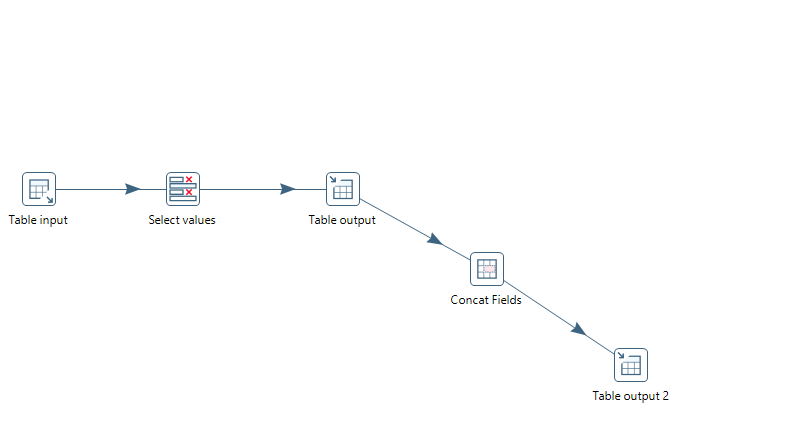

# Process Integration

Process Integration is an open source application for data transformation.  
It uses Pentaho Data Integration (PDI) tool for data transformation.  


## Getting Started / Installation


### Built With
 This application is generated with [Angular CLI](https://github.com/angular/angular-cli) version 7.3.5.    
 It uses SpringBoot, Spring REST, Spring Data JPA, Maven and Pentaho API to build Data Integration Service.  

### Prerequisites
- Node.js need to be installed on local machine to run npm commands required for the configuration of the application.  
   install [node.js](https://nodejs.org/en/) here.  
- Angular/cli needs to be installed to run application.
```bash
npm install -g @angular/cli
```

- Java (version 8) and [maven](http://maven.apache.org/download.cgi) has to be installed on local machine.  
- Postgres need to be installed on local machine on port 5432.
- Pentaho Data Integration Tool need to be installed on local machine.To know more about Pentaho Data Integration goto [Pentaho Data Integration](https://help.pentaho.com/Documentation/7.1/0D0/Pentaho_Data_Integration).  
 After installation complete, Update application property to

```bash
  pentaho.plugin = [provide path pentaho/plugins]
```
  
- Kettle Transformation(KTR) Management([ what is ktr? ]()):
   - ktr files are generated as output of PDI Tranformations which provides data mining and extract, transform, load (ETL) capabilities. 
   - Despite the ktr and kjb extensions, PDI transformations and jobs are just XML files.
   - ktr(s) will be created offline on the server where Pentaho is installed.  
     
- KTR Structure
  - Ktr file name has to be the process name.
  - The format for input file to the KTR is {ProcessName}_input.{extension}.  
  - Output of the KTR will be {ProcessName}_output.{extension}.

- To run existing database transformation process from application, follow following rules:  
   - Create source database with name 'demo' in mysql using ~\Service\dataintegrationservice\src\main\DbScripts\SourceDbScript.sql.
   - Create target database with name 'SamplePostgresDb' in postgress using    ~\Service\dataintegrationservice\src\main\DbScripts\TargetDbScript.sql.
   - Update application-dev file from ~\Service\dataintegrationservice\src\main\resources accordingly.  
### Setting up

Here's a brief introduction  about what a user must do in order to start using the application further:

```bash
git clone https://github.com/your/your-project.git
cd your-project/Web
npm install  
Run ng serve  
Navigate to http://localhost:4200/. 
``` 


Steps to Configure Data Integration Service.  

- Create database 'DataIntegrationServiceDev' for dev active profile with 'dataintegration' as username and 'root' as a password.

```bash
cd Service/dataintegrationservice
Execute command mvn clean install

```
- There are multiple ways to start service  

  -  Execute command in the location of dataintegrationservice-1.0.0.jar.    
     java -jar -Dspring.profiles.active=dev dataintegrationservice-1.0.0.jar.    
     Possible values for profiles.active = dev, test, production  

  -  Import project in eclipse and right click on DataIntegrationApplication.java, Run as Java Application.

Default server port is 8080.  
User can change embeded tomcat server port by configuring "server.port" property in application-{profile}.properties file.  


## Usage

### Features
Process Integration supports two use cases  
- File transformation (ex: csv to json)
   - In file tranformation data will be Retrieving from a source file and transformed into the target file or database of user choice.  
   - It supports sorting, filtering and various other operaions on data. 
     
- Database transformation (ex: MySQL to Postgres)
  - In database transformation source database is transformed into target database of use choice.
  - Data can be extracted from a table of source database and spreaded over multiple tables of a target database.


### Screens
  Sample ktr file for database to database tranformation.  
    


## Contributing

Please read [CONTRIBUTING.md]() for details on our code of conduct, and the process for submitting pull requests to us.

## License

This project is licensed under the MIT License - see the [LICENSE.md](License.md) file for details

